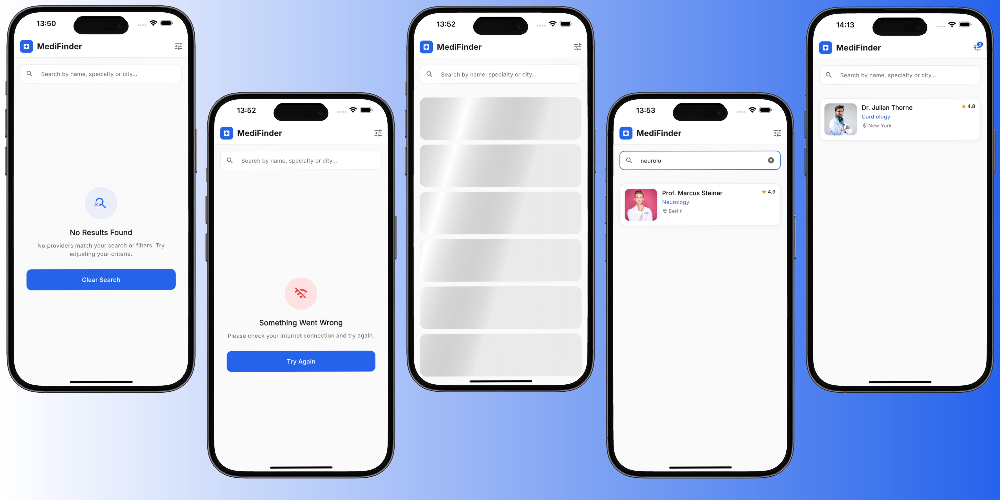

### **Mimari Yaklaşım ve Teknik Kararlar**

Bu proje, sürdürülebilir ve üretim kalitesine yakın kod standartlarını karşılamak amacıyla Clean Architecture ve Feature-based MVVM prensipleriyle kurgulanmıştır. State yönetimi ve bağımlılık enjeksiyonu standart modern araçlarla kurgulanmış; veri akışı ise tip güvenli bir durum (state) yapısıyla güvence altına alınarak arayüzdeki belirsizlikler önlenmiştir.  

Arayüz, tasarım sistemine uyumlu ve yeniden kullanılabilir kompozit bileşenlerden oluşturulmuş; olası null veya eksik veriler Domain katmanında güvenle normalize edilmiştir. Arama optimizasyonları, zarif hata yönetimi ve kod değişikliği gerektirmeyen backend (REST/GraphQL) geçiş altyapısı ile uygulamanın mevcut gereksinimleri eksiksiz karşılanmış ve uzun vadeli ölçeklenebilirliği kanıtlanmıştır.  

### **Önemli Noktalar**  

Bu proje, ölçeklenebilirlik, test edilebilirlik ve sürdürülebilirlik odaklı mühendislik prensipleriyle (Clean Architecture & SOLID) kurgulanmıştır.  

**Kod Organizasyonu (Feature-First Architecture)**  

Kod tabanı, modüler bir yapıda tasarlanmıştır. Her bir özellik; kendi içinde veri, iş kuralları ve sunum katmanlarına izole edilmiştir. Bu ayrım (Separation of Concerns), iş kurallarını arayüzden ve veri katmanından tamamen bağımsızlaştırarak refactoring güvenliğini ve test edilebilirliği en üst düzeye çıkarır.  

**Component Yapısı (Atomic Design & Design Tokens)**  

Kullanıcı arayüzü; bağımsız, esnek ve yeniden kullanılabilir atomik bileşenlerden inşa edilmiştir. Projede sabit (hard-coded) stil değerleri kullanılmamış; renk, font ve boyut gibi tüm referanslar Design Token yaklaşımıyla merkezi olarak yönetilmiştir. Bu yapı, olası tema değişikliklerinin mimariyi bozmadan tek merkezden güvenle yapılabilmesini garanti eder.  

**Navigation Kurgusu (Declarative Routing)**  

Sayfa yönlendirmeleri için deklaratif ve tip güvenli (type-safe) bir routing altyapısı tercih edilmiştir. Rota parametreleri ve önbellek verileri ekranlara güvenli bir şekilde aktarılırken; derin bağlantı (deep-linking) ve geri dönüş (back-stack) işlemleri, bellek sızıntılarını önleyecek şekilde merkezi bir mekanizmayla kontrol altına alınmıştır.  

**State Yönetimi (Sealed Classes & Unidirectional Data Flow)**  

State yönetimi, Dependency Injection (DI) prensipleri merkeze alınarak tasarlanmıştır. Arayüz üzerindeki tutarsızlıkları önlemek adına durum geçişleri, mühürlü sınıf (sealed class) mimarisiyle modellenmiştir. Durum güncellemeleri ekranın yaşam döngüsü kontrollerinden geçirilerek olası bellek sızıntıları tamamen engellenmiştir.  

**Null Safety & Veri Bütünlüğü (Defensive Programming)**  

Veri kaynağından gelebilecek potansiyel eksik veriler, Domain katmanında esnek bir şekilde ele alınmıştır. Arayüz tarafında bu veriler, defansif programlama yaklaşımıyla güvenli kontrollerden geçirilir. Eksik verilerde uygulamanın çökmesi engellenerek varsayılan (fallback) bileşenlerin sorunsuz gösterilmesi sağlanır.  

**Durum Yönetimi (Exhaustive Pattern Matching)**  

Asenkron işlemlerin sonuçları derleyici destekli bloklar ile yönetilerek "yakalanmayan durum" riski sıfıra indirilmiştir. Yükleme esnasında performansı yüksek hissettirmek için iskelet ekranlar (shimmer) kullanılmış; boş liste ve hata durumlarında ise kullanıcıyı yarı yolda bırakmayan eyleme dönüştürülebilir yönlendirmeler tasarlanmıştır.  

**Performans ve UX Optimizasyonları**  

Arama operasyonlarında ana akışı bloklamamak ve gereksiz API/render çağrılarını engellemek için zamanlayıcı (debounce) optimizasyonları yapılmıştır. Durum güncellemelerindeki ani arayüz değişimleri animasyonlarla sönümlenmiş ve sanal klavye etkileşimlerinde ekran düzeninin bozulması önlenmiştir.  

**Kod Kalitesi ve Test Edilebilirlik**  

İş mantığı ve mimari bileşenler kapsamlı yorum bloklarıyla belgelendirilmiş, sınıflar Tek Sorumluluk Prensibi (SRP) standartlarında tutulmuştur. Regresyon güvenliği; birim, arayüz ve entegrasyon testleriyle (56/56 başarı) doğrulanmış; statik analiz süreci sıfır hatayla canlı ortama (CI-CD/Production) hazır hale getirilmiştir.

### **Test Stratejisi ve Kalite Güvencesi**

Projenin yalnızca "çalışır" durumda olmasını değil, aynı zamanda üretim ortamında yüksek stabilite ve güvenilirlik sunmasını sağlamak amacıyla 3 katmanlı, kapsamlı bir test mimarisi kurgulanmıştır.  

**Ne Yaptım? (Kapsam)**  

Arama ve filtreleme akışı uçtan uca güvence altına alınmıştır. Saf iş mantığını, arayüz davranışlarını ve sayfa yönlendirme senaryolarını kapsayan bir test paketi geliştirilerek "yakalanmayan/tanımsız durum" riski ortadan kaldırılmıştır.  

**Nasıl Yaptım? (Uygulama Pratikleri)**

* **Birim Testleri:** İş mantığı arayüzden tamamen izole edilerek test edildi; veri normalizasyonu, filtre algoritmaları ve durum makinesinin doğruluğu kanıtlandı. 

* **Arayüz Testleri:** Kullanıcı arayüzü bileşenlerinin durum değişimlerine tepkileri simüle edildi; başarılı, boş veya hatalı listeleme senaryolarında doğru widget'ların gösterildiği kanıtlandı.  

* **Bellek Güvenliği:** Yaşam döngüleri test edilerek sayfa kapatıldıktan sonra oluşan tetiklemelerin yaratabileceği bellek sızıntıları (memory leak) engellendi.  

* **Yönlendirme Testleri:** Eksik parametrelerle veya derin bağlantılarla sayfaya giriş senaryoları test edilerek uygulamanın çökmesi yerine zarif hata ekranlarına yönlenmesi sağlandı.

**Neden Yaptım? (İş Değeri ve Mimari Vizyon)**  
Bu test stratejisinin temel amacı projeye %100'e yakın regresyon koruması sağlamaktır.

* **Çökme Önleme:** Bellek sızıntısı ve eksik veri testleri sayesinde potansiyel çökme oranları (ANR) minimize edilmiştir.

* **UX Tutarlılığı:** Hata anında veya verinin olmadığı durumlarda kullanıcının beyaz/tanımsız ekranlarda kalması engellenmiştir.

* **Sürdürülebilirlik:** Gelecekte eklenecek yeni özellikler veya gerçek bir API geçişi (refactoring) sırasında kodun kırılmasını anında tespit edecek güvenilir bir altyapı oluşturulmuştur.

* **Tasarım Bütünlüğü:** Eksiksiz test paketi, tasarım sisteminin ve bileşen hiyerarşisinin korunduğunu garanti eder, böylece her güncelleme sonrası görsel tutarlılık sağlanır.

### Offline ve Ağ Kurtarma (Retry) Senaryoları

Uygulamanın ağ kesintileri ve sunucu hataları karşısında dayanıklılığını (resilience) artırmak için proaktif ve defansif hata yönetimi yaklaşımları uygulanmıştır.

**Offline (Bağlantı Kesintisi) Yönetimi ve Önbellek Desteği**

Ağ bağlantısı koptuğunda sistem "Graceful Degradation" (zarif bozulma) prensibiyle hareket eder. Uygulama çökmez veya sonsuz yükleme ekranında asılı kalmaz. Eğer mevcutsa, yerel hafızada (local storage/cache) tutulan son başarılı sorgu sonuçları kullanıcıya sunulmaya devam eder. Önbellekte veri bulunmadığı senaryolarda ise, Domain katmanından fırlatılan ağ hataları yakalanarak arayüzde kullanıcının ne yapması gerektiğini açıklayan, eyleme dönüştürülebilir yönlendirmelere dönüştürülür.

**Durum Korumalı Retry (Tekrar Deneme) Mekanizması**

Olası bir hata durumunda kullanıcının arama ve filtreleme eforunu kaybetmemesi adına, yapılan son isteğin parametreleri (arama metni ve seçili filtreler) State (ViewModel) üzerinde güvenle muhafaza edilir. Kullanıcı "Tekrar Dene" aksiyonunu tetiklediğinde; varsa devam eden diğer zamanlayıcılar (debounce) iptal edilir, saklanan state ile ağ isteği anında yeniden başlatılır ve arayüz güvenli bir şekilde "Loading" durumuna geçirilerek sistemin tepkiselliği (responsiveness) korunur.

**Kesintisiz UX ve Sistem Kararlılığı**

Bu kurgu sayesinde uygulama hiçbir senaryoda çıkmaz sokağa (dead-end) girmez. Hata ve kurtarma ekranları uygulamanın genel tasarım token'ları ile inşa edildiğinden görsel mimari bütünlük korunur. Manuel tekrar deneme kurgusu sayesinde, gereksiz otomatik istek (exponential backoff) döngülerinden kaçınılarak kaynak tüketimi optimize edilmiş ve kontrol tamamen kullanıcıya bırakılmıştır.

### Uygulama Ekran Resimleri

Bu bölümde yer alan ekran görüntüleri; uygulamanın provider listeleme, detay görüntüleme ve filtreleme özelliklerinin arayüze nasıl yansıdığını göstermektedir.

Tasarım dili, medikal temaya sadık kalarak, kullanıcı deneyimini merkeze alan modern ve mikro-etkileşimlerle desteklenen akıcı bir yapı sunar.

Üretim kalitesi (pixel-perfect) standartları gözetilerek kurgulanan mimaride, ikinci görselde vurgulandığı üzere yükleme (loading/shimmer), boş liste (empty) ve ağ hatası (error) stateleri eksiksiz ele alınmış ve durumlar arası geçişler animasyonlarla yumuşatılmıştır.

Bilişsel yükü azaltmak adına filtreleme akışında "önce ülke, sonra şehir" seçimi gibi mantıksal bir UX hiyerarşisi uygulanmış, ayrıca tek tıkla tüm filtreleri temizleyip ana listeye dönmeyi sağlayan hızlı bir aksiyon kurgulanmıştır.

Geliştirilen bu altyapı, yalnızca mevcut gereksinimleri karşılamakla kalmayıp, veri odaklı ve yapay zeka (AI) destekli ürün vizyonuna da zemin hazırlamaktadır.

Ana sayfadaki arama modülü şu an branş ve şehir bazlı çalışırken, mevcut mimari ilerleyen aşamalarda bir NLP (Doğal Dil İşleme) katmanıyla entegre edilebilecek esnekliğe sahiptir; bu sayede kullanıcıların "İstanbul'daki onkologlar" gibi serbest metin sorgularının akıllıca ayrıştırılıp (parse) otomatik filtrelemeye dönüştürülebilmesi mümkündür. 

Bu yaklaşım, sadece bir arayüz inşa etmenin ötesinde, ölçeklenebilir ve uzun vadeli bir ürün geliştirme (builder mindset) vizyonunu yansıtmaktadır.

### Uygulama Videosu

Uygulamanın arayüz kalitesini, mikro-etkileşimlerini, hata ve asenkron durum (state) yönetimini (Shimmer Loading, Empty State, Offline Retry) gösteren kısa bir demo videosuna aşağıdan ulaşabilirsiniz.

### Rapor Özeti

Bu proje, ölçeklenebilir ve sürdürülebilir bir altyapı sunmak amacıyla Clean Architecture ve Feature-based MVVM prensipleriyle geliştirilmiştir. İş kuralları, veri erişimi ve sunum katmanları birbirinden tamamen izole edilerek kodun bağımsızlığı ve test edilebilirliği en üst düzeye çıkarılmıştır. Arayüz tasarımı, atomik tasarım yaklaşımıyla herhangi bir sabit değer içermeden, yüksek oranda yeniden kullanılabilir ve temaya duyarlı kompozit bileşenler kullanılarak inşa edilmiştir. 

Durum (state) yönetimi, Dependency Injection temelli kurgulanarak mühürlü sınıflar (sealed classes) aracılığıyla tip güvenli bir yapıya kavuşturulmuştur. Bu sayede asenkron veri akışındaki yükleme, boş liste ve hata gibi durumlar arayüzde belirsizliğe yer bırakmadan net bir şekilde yönetilir. Ayrıca, defansif programlama ile olası eksik veya null veriler güvenle normalize edilmiş, bellek sızıntılarını önleyen yaşam döngüsü kontrolleriyle pürüzsüz bir genel kullanıcı deneyimi güvence altına alınmıştır.  

Sistem, üretim kalitesini garanti altına almak için birim, arayüz ve entegrasyon testlerini içeren kapsamlı bir test paketiyle regresyonlara karşı korunmaktadır. Olası ağ kesintileri ve sunucu hatalarına karşı proaktif bir yaklaşım benimsenerek zarif bozulma (graceful degradation) stratejisi uygulanmıştır. Kullanıcının arama ve filtreleme tercihleri durum (state) üzerinde korunarak, görsel bütünlüğü bozmayan akıllı bir tekrar deneme (retry) ve önbellek mekanizmasıyla kesintisiz bir deneyim sunulmaktadır.  

Hazırlanan ekran kaydı demosu, uygulamanın arayüz kalitesini, mikro-etkileşimlerini ve akıcı durum geçişlerini canlı olarak sergilemektedir. Sonuç olarak bu vaka çalışması, sadece mevcut listeleme ve filtreleme gereksinimlerini eksiksiz karşılamakla kalmaz. Aynı zamanda gelecekteki yapay zeka tabanlı doğal dil işleme entegrasyonlarına ve gerçek API geçişlerine kod değişikliği gerektirmeden uyum sağlayabilecek, uzun vadeli bir mühendislik vizyonu ortaya koyar. 